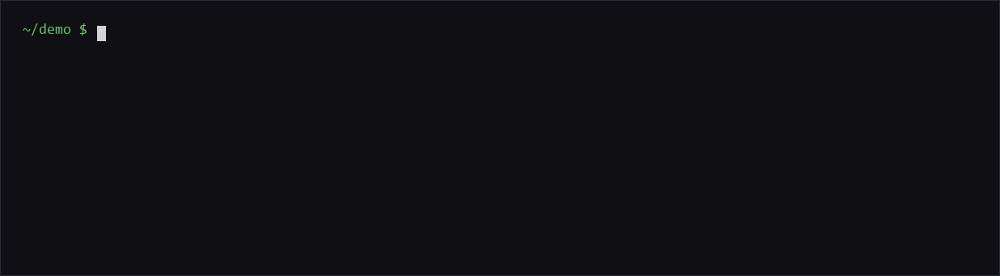
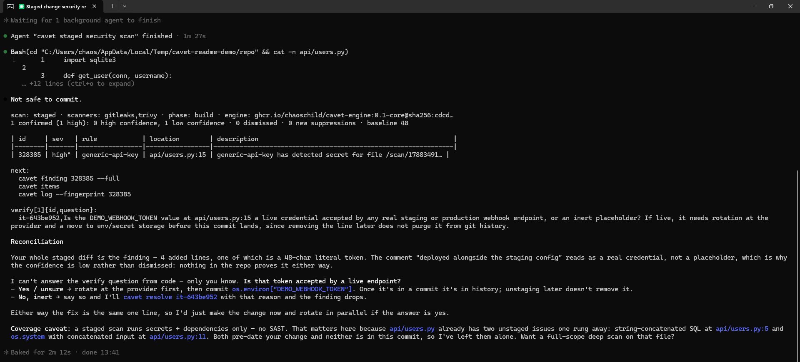
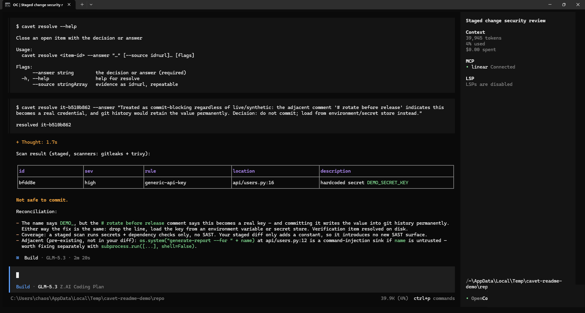

# cavet

[](https://github.com/ChaosChild/cavet/releases/latest)
[](https://github.com/ChaosChild/cavet/actions/workflows/ci.yml)
[](https://pkg.go.dev/github.com/ChaosChild/cavet)
[](https://goreportcard.com/report/github.com/ChaosChild/cavet)
[](https://github.com/ChaosChild/cavet/blob/main/LICENSE)

From *caveat*, "let him beware". A warning, not a prohibition.

Most of the code landing in repositories now is written by coding agents –
sometimes eager to please the operator, and happy to skip the boring parts. At
the same time, the agentic workflows doing the writing are themselves a rising
attack surface. Put the two together and the direction is set: as agent-written
code accelerates, the attack surface of the products being shipped has to
shrink, not grow.

Security scanning already exists – most CI stacks run the same scanners cavet
wraps – but it runs after the agent is done, and a finding that arrives after
the change is complete arrives too late to shape it. Prose goes further: a
paragraph in the system prompt, a section in the agent instructions, a skill. Any
of these can tell an agent to be security-aware while it designs and
builds. It works, in the sense that it sometimes fires. But prose is advice,
not a guarantee: it does not behave the same way twice, and it evaporates
between sessions.

And when CI does flag something, the findings land in a new agent session that
has none of the context that produced them: what the previous session decided
during design, why it decided it, and which of these findings are pre-existing
baseline debt versus newly introduced by the change. The same false positive
gets rediscovered and re-argued from first principles, session after session.

cavet is one operator's answer, in toolkit form: security at the same speed as
everything else – operators and their agents producing more secure products,
more often, with repeatable efficiency. The audit trail and the recorded
baseline carry the context between sessions; the skills advise at the moments
where judgement is actually needed; the CLI records every judgement – verdict,
reason, actor – and is the only author of that record. The same checks, the
same phases, the same output shape, the same audit trail, session after
session. **Nothing blocks.** Everything advises. The agent or the operator
chooses to remediate, defer, or dismiss. Teams that need enforcement build it
themselves around these tools.

**Status:** v0.1.0. The CLI, the multi-arch engine image, installers for seven
harnesses, and CI are all here and working;
[SPECIFICATION.md](docs/SPECIFICATION.md) remains the design of record.

<p></p>
<p>
  
</p>
<p>
  
</p>

## Installation

### Prerequisites

1. **Docker**, with a running daemon – `cavet init` probes it first and tells you
   if it is unreachable.
2. **A `cavet` binary** – the one-liner below installs it, or any channel in
   [Advanced: other install channels](#advanced-other-install-channels).
3. **A git repository you want covered.**

### Install

One line per platform – checksum-verified download, binary on your `PATH`:

```sh
curl -fsSL https://raw.githubusercontent.com/ChaosChild/cavet/main/installers/binary.sh | bash
```

Installs the latest release for your OS/arch (darwin/linux × amd64/arm64)
into `~/.local/bin` – override with `--dir <path>` or `CAVET_INSTALL_DIR`, pin
a version with `bash -s -- --version <x.y.z>`. Windows (pwsh, canonical
two-step form – a piped script cannot bind `param()`):

```pwsh
irm https://raw.githubusercontent.com/ChaosChild/cavet/main/installers/binary.ps1 -OutFile binary.ps1
pwsh -NoProfile -File binary.ps1
```

Installs into `$HOME\.local\bin` and adds that directory to your user `PATH`
(override with `-InstallDir`). Every download is verified against the release
`checksums.txt`, and against the Sigstore signature too when
[cosign](https://docs.sigstore.dev/cosign/system_config/installation/) is
installed. Other channels – manual download, `go install`, Homebrew, Scoop –
are in [Advanced: other install channels](#advanced-other-install-channels).

### Engine image

Nothing to install by hand: `cavet init` pulls the engine image,
`ghcr.io/chaoschild/cavet-engine` – public, multi-arch (`linux/amd64`,
`linux/arm64`), and digest-pinned into `.cavet/config.yaml` on first run.

- Two variants: **core** (default – secrets, dependencies, SAST) and **full**
  (adds Trivy's Java vulnerability database); set `engine.variant` in
  `config.yaml`.
- `CAVET_ENGINE_IMAGE` overrides the image reference entirely – local builds,
  mirrors, pinning.

The image bundles Opengrep, Gitleaks and Trivy. The Opengrep rule corpus is
LGPL-2.1 + Commons Clause: using cavet is fine, selling a service whose value
derives from those rules is not – see the [licence table](#licence).

### `cavet init`

Run it in the repository you want covered:

```sh
cd your-repo
cavet init             # add --hooks to also install the advisory pre-commit hook
```

It scaffolds `.cavet/`, pulls and starts the engine container, and runs a full
baseline scan that records every pre-existing finding as debt (work through it
later with `cavet debt`).

| Path | Commit? |
|---|---|
| `log/` | yes – the append-only audit trail (`.gitattributes` sets `merge=union` on it) |
| `config.yaml` | yes – engine variant + digest pin |
| `design/` | yes – design decisions |
| `state/`, `cache/`, `reports/` | no – derived; `cavet rebuild` regenerates them |

The scaffolded `.gitignore` already excludes the derived directories. Never
edit `log/` by hand – the CLI is its only author.

### Harness setup

The six `cavet-*` skills and the `cavet-security` subagent ride along into your
coding agent. The binary from the step above is still required – the skills
drive the CLI, they do not replace it.

**Claude Code** (plugin, no clone needed):

```
/plugin marketplace add ChaosChild/cavet
/plugin install cavet@cavet
```

**Every other harness** – codex, opencode, pi, hermes, zcode, deepseek – one
line, no clone needed:

```sh
curl -fsSL https://raw.githubusercontent.com/ChaosChild/cavet/main/installers/fetch.sh | bash -s -- --harness codex
```

pwsh (canonical two-step form – a piped script cannot bind `param()`):

```pwsh
irm https://raw.githubusercontent.com/ChaosChild/cavet/main/installers/fetch.ps1 -OutFile fetch.ps1
pwsh -NoProfile -File fetch.ps1 -Harness codex
```

Or from a clone: `bash installers/<harness>.sh` / `pwsh installers/<harness>.ps1`
for any of the seven harnesses. What lands where, per harness:
[installers/README.md](installers/README.md).

### First scan

```sh
git add -A
cavet scan --staged
```

Exit codes are informational, never gating: `0` clean (or nothing staged),
`1` findings present, `2` error. `cavet --help` lists everything;
`cavet describe --json` emits the machine contract for tooling that wants it.

### Advanced: other install channels

<details>
<summary>GitHub Releases manual download · go install · Homebrew · Scoop</summary>

#### GitHub Releases

Pick your OS/arch archive from
<https://github.com/ChaosChild/cavet/releases/latest>, and download
`checksums.txt` and `checksums.txt.sigstore.json` alongside it. cavet is a
security tool: verify before trusting the download. Both the signature and the
checksums are produced by the repo's own release workflow, so pin the
certificate identity to it (no cosign yet?
[Install it](https://docs.sigstore.dev/cosign/system_config/installation/)):

```sh
cosign verify-blob \
  --bundle checksums.txt.sigstore.json \
  --certificate-identity-regexp '^https://github\.com/ChaosChild/cavet/\.github/workflows/release\.yml@' \
  --certificate-oidc-issuer https://token.actions.githubusercontent.com \
  checksums.txt

sha256sum --check --ignore-missing checksums.txt   # macOS/Linux
# Windows: compare (Get-FileHash cavet_0.1.0_windows_amd64.zip).Hash against checksums.txt
```

Each archive holds the binary (`cavet`, or `cavet.exe` on Windows), `LICENSE`
and `README.md` at its root – `./cavet` runs straight from the extraction
folder, no install step needed. To put it on your `PATH`:

```sh
tar -xzf cavet_0.1.0_linux_amd64.tar.gz   # or: unzip cavet_0.1.0_windows_amd64.zip
sudo install -m 0755 cavet /usr/local/bin/cavet
```

#### go install

```sh
go install github.com/ChaosChild/cavet/cmd/cavet@latest
```

The binary lands in `$GOPATH/bin/cavet` (or `$GOBIN/cavet` if set) – a
directory Ubuntu does not put on your `PATH` by default. Fix:

```sh
echo 'export PATH="$PATH:$(go env GOPATH)/bin"' >> ~/.profile
```

then log out and back in.

#### Homebrew (macOS, Linux)

```sh
brew install --cask chaoschild/tap/cavet
```

#### Scoop (Windows)

```pwsh
scoop bucket add chaoschild https://github.com/ChaosChild/scoop-bucket
scoop install cavet
```

</details>

## What it does

| Command | |
|---|---|
| `init` | Scaffold `.cavet/`, start the engine, record existing debt as baseline |
| `scan` | Run scanners for a scope and fold the delta |
| `finding` | Show one finding: row, locations, verdict |
| `debt` | The pre-existing baseline, on demand only |
| `triage` | Record a confirm or dismiss verdict with reason and confidence |
| `suppress` | Silence a finding deliberately, with a reason |
| `defer` | Acknowledge a finding, act later |
| `log` | Read the audit trail, newest first |
| `items` | List open items: design concerns and verification requests |
| `raise` | Open an item: a design concern or a verification request |
| `resolve` | Close an open item with the decision or answer |
| `lookup` | Advisory, package, and rule lookup – identifiers only, by design |
| `engine` | Control the long-lived scanner container |
| `rebaseline` | After a deliberate engine change: regenerate the baseline |
| `rebuild` | Regenerate `state/` from the log (the source of truth) |
| `describe` | Machine contract for third-party installers |

Judgement lives in the skills: `cavet-design`, `cavet-design-review`,
`cavet-secure-coding`, `cavet-triage`, `cavet-supply-chain`, `cavet-deployment`,
plus the `cavet-security` subagent that does focused review with nothing but
Read and a cavet-only shell. The skills advise; the CLI is the only author of
`.cavet/` artefacts – every verdict, deferral, and suppression lands in the log
with a reason and an actor.

## Documentation

- [SPECIFICATION.md](docs/SPECIFICATION.md) – what this is and why it is shaped
  this way. The design story, kept in the repo.
- Build and development documentation – implementation history, the spec
  annexes, the scanner spike, the distribution plan, install internals – lives
  at <https://migatchev.co.za/projects/cavet>.

## Licence

`cavet` itself is MIT. See [LICENSE](LICENSE).

**The engine image is not uniformly MIT**, and the difference matters if you intend
to sell something built on this:

| Component | Licence |
|---|---|
| `cavet` CLI, skills, subagent, installers | MIT |
| Gitleaks | MIT |
| Trivy | Apache-2.0 |
| Opengrep engine | LGPL-2.1 |
| **Opengrep rule corpus** | **LGPL-2.1 + Commons Clause** |

The Opengrep rules are the `semgrep-rules` corpus, licensed by Semgrep, Inc. under
LGPL-2.1 with a Commons Clause condition: you may not *sell* a product or service
whose value derives entirely or substantially from them. Using `cavet`, distributing
it, and building on it are all unaffected. Selling a hosted service whose value comes
substantially from those rules is not.

The rules are only loaded by the deep scan tier. The fast tier – secrets and
dependency scanning, which is what the pre-commit hook and staged scans use – is
entirely MIT and Apache-2.0, and Opengrep can be disabled outright in `config.yaml`.
